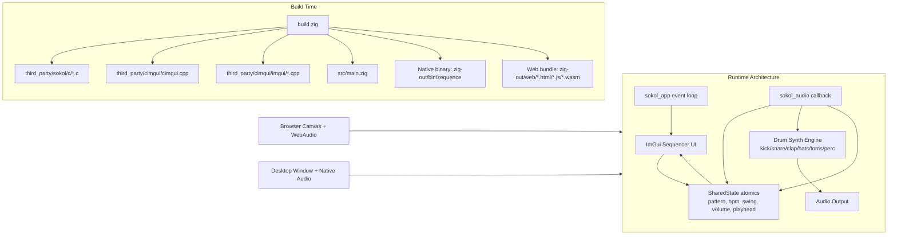

# Zequence (Zig + Sokol + ImGui)

Desktop + Web drum sequencer built with:
- Zig 0.15.2
- `sokol_app`, `sokol_gfx`, `sokol_audio`, `sokol_imgui`
- Dear ImGui via `cimgui`

## Prerequisites

- Zig 0.15.2
- For native builds:
  - macOS: Xcode command line tools
  - Linux: OpenGL + X11 + ALSA development libraries
- For web builds:
  - Emscripten SDK (`emsdk`)

## Third-Party Libraries And Tools

This repo vendors dependencies under `third_party/`:
- `third_party/sokol` (already included)
- `third_party/cimgui` (already included)
- `third_party/cimgui/imgui` (git submodule)

If you clone/fork this project elsewhere, initialize submodules:

```bash
git submodule update --init --recursive
```

### How Third-Party Libraries Are Built In This Project

You do not need to manually build Sokol or CImGui for this app.
`zig build` compiles third-party sources directly:
- Sokol C files from `third_party/sokol/c/*.c`
- CImGui + Dear ImGui C++ files from:
  - `third_party/cimgui/cimgui.cpp`
  - `third_party/cimgui/imgui/*.cpp`

### Optional: Build CImGui Manually (Standalone)

Only needed if you want a separate CImGui library outside this Zig build.

```bash
cd third_party/cimgui
make            # builds shared lib (e.g. cimgui.dylib / cimgui.so)
make static     # builds libcimgui.a
```

## Future Considerations

- Keep current vendored dependency strategy for now (stable and reproducible).
- Revisit migrating `third_party/sokol` to a Zig package dependency.
- If/when `cimgui` provides first-class Zig package metadata, evaluate replacing vendored `third_party/cimgui` with package-managed dependency resolution.
- Optionally replace manual `-Demsdk=<path>` usage with an explicit package-managed `emsdk` dependency in build configuration.

## Design And Architecture



## Build And Run (Native)

```bash
zig build run
```

Binary output:
- `zig-out/bin/zequence`

## Build For Web (WASM + Emscripten)

If `emsdk` is already installed at `/Users/bernal/git/emsdk`:

```bash
zig build web -Demsdk=/Users/bernal/git/emsdk
```

Web bundle output:
- `zig-out/web/zequence.html`
- `zig-out/web/zequence.js`
- `zig-out/web/zequence.wasm`

Run a local web server:

```bash
python3 -m http.server 8080 --directory zig-out/web
```

Then open:
- `http://localhost:8080/zequence.html`

## Deploy Web Build To GitHub Pages

This repo includes `.github/workflows/deploy-pages.yml` to publish the web build on pushes to `main`.

Expected custom domain:
- `zequence.cbrnl.com`

Setup once in GitHub:
1. Open repo `Settings` -> `Pages`
2. Under `Build and deployment`, set `Source` to `GitHub Actions`
3. Ensure DNS has `CNAME` `zequence` -> `cabernal.github.io`

## Emsdk Setup (If Needed)

```bash
git clone https://github.com/emscripten-core/emsdk.git
cd emsdk
./emsdk install 4.0.14
./emsdk activate 4.0.14
source ./emsdk_env.sh
```

Then build web:

```bash
cd /path/to/zequence
zig build web -Demsdk=/path/to/emsdk
```

## Controls

- Click `Play` / `Stop` for transport
- Click grid cells to toggle drum steps
- `Space` toggles play/stop
- `R` randomizes the pattern
- `Tempo`, `Swing`, and `Master Volume` sliders control playback
